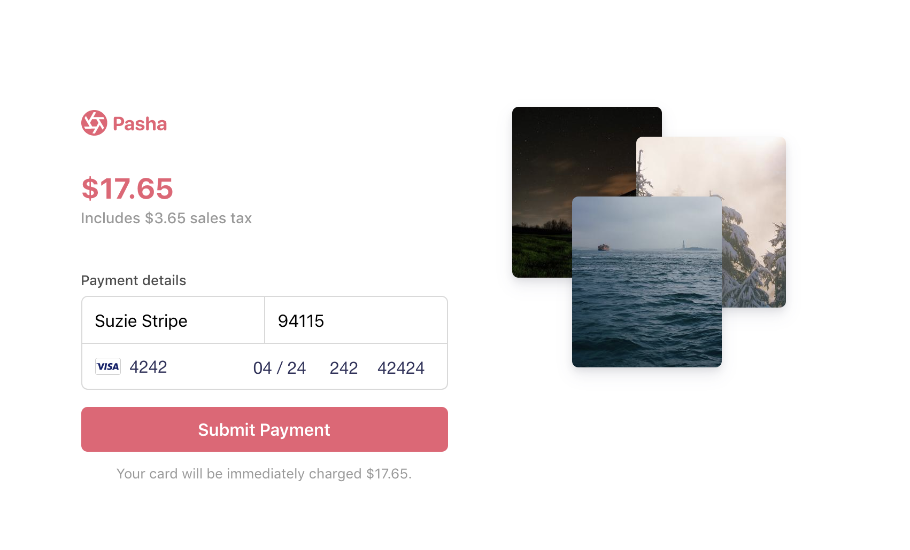

# Sales tax sample
There are two things certain in life: death and taxes. 

This sample shows how to build a minimal checkout form with a sales tax estimator and charge a card using the new [Payment Intents API](https://stripe.com/docs/payments/payment-intents). The logic for calculating the sales tax is simplified -- replace with your own method of calculating tax for your unique business needs. The amount of sales tax to collect depends on the product, the location of the customer, and local tax laws. 

See a [hosted version](https://cf6kr.sse.codesandbox.io/) of the demo in test mode or fork on [codesandbox.io](https://codesandbox.io/s/stripe-sample-sales-tax-cf6kr)



There are two implementations: manual and automatic confirmation. [Confirmation](https://stripe.com/docs/api/payment_intents/confirm) is how you finalize a payment on Stripe. If you are comfortable using webhooks for any post-payment logic (e.g. sending email receipts, fulfilling orders) then use [automatic confirmation](/auto-confirmation) which will confirm the payment on the client. Otherwise, use [manual confirmation](/manual-confirmation) to confirm the payment on the server and immediately run any post-payment processes.   

This sample shows:
<!-- prettier-ignore -->
|     | Manual confirmation | Automatic confirmation
:--- | :---: | :---:
💳 **Collecting card and cardholder details.** Both integrations use [Stripe Elements](https://stripe.com/docs/stripe-js) to build a custom checkout form. | ✅  | ✅ |
🙅 **Handling card authentication requests and declines.** Attempts to charge a card can fail if the bank declines the purchase or requests extra authentication.  | ✅  | ✅ |
↪️ **Using webhooks to fulfill after a payment succeeds.** Automatic confirmation confirms the payment on the client and requires using webhooks for actions that need to happen post-payment. | ❌ | ✅ |
💰 **Tracking multiple payment attempts in a PaymentIntent.** Automatic confirmation lets you use a PaymentIntent for multiple payment attempts so you can track the customer's payment session in one object. | ❌ | ✅ |


## How to run locally
Each sample implementation includes 5 servers in Node, Ruby, Python, Java, and PHP in the /server/ directory. 

If you want to run the sample locally, copy the .env.example file to your own .env file in the integration you want to try: 

```
cp .env.example .env
```

You will need a Stripe account with its own set of [API keys](https://stripe.com/docs/development#api-keys).

## FAQ
Q: Why did you pick these frameworks?

A: We chose the most minimal framework to convey the key Stripe calls and concepts you need to understand. These demos are meant as an educational tool that helps you roadmap how to integrate Stripe within your own system independent of the framework.

Q: Can you show me how to build X?

A: We are always looking for new sample ideas, please email tbd@stripe.com with your suggestion!

## Author(s)
[@adreyfus-stripe](https://twitter.com/adrind)
